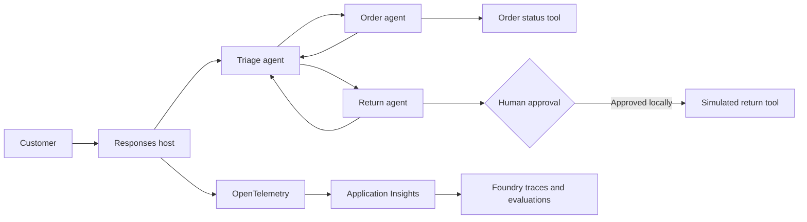

## Build a governed multi-agent customer-support workflow

In this three-hour workshop, you build a customer-support workflow with
Microsoft Agent Framework (MAF), test human-in-the-loop (HITL) behavior,
deploy the workflow as a Microsoft Foundry hosted agent, inspect distributed
traces, and apply an evaluation-based release gate.

The scenario uses simulated order and return tools. It never modifies an
external system.

> [!IMPORTANT]
> The local profile demonstrates interactive handoffs and tool approval. The
> hosted profile uses autonomous handoffs so it can complete within one
> Responses API invocation. Durable hosted HITL requires checkpoint and
> session persistence and is covered as an instructor discussion.

## Learning objectives

By the end of the workshop, you can:

- Explain the responsibilities of MAF and Foundry Agent Service
- Build specialized agents with constrained handoff routes
- Handle conversational input and tool approval events
- Run a workflow with Foundry Toolkit Agent Inspector
- Deploy Python source as a Foundry hosted agent
- Inspect agent, model, handoff, and tool-call traces
- Evaluate a deployed version against release thresholds

## Scenario

Contoso Support wants one conversational entry point for order tracking and
product returns. The solution separates responsibilities across three agents:

| Agent        | Responsibility                                 |
| ------------ | ---------------------------------------------- |
| Triage agent | Classify the request and select a specialist   |
| Order agent  | Retrieve simulated order status                |
| Return agent | Collect return details and simulate the return |

The local workflow adds a human approval gate before the return tool executes.
The hosted workflow uses the same agents and routing policy with a simulated
autonomous tool.

## Architecture



The source for this diagram is available in
[`assets/architecture.mmd`](assets/architecture.mmd).

## Workshop schedule

| Time      | Module                                        |
| --------- | --------------------------------------------- |
| 0:00-0:15 | Architecture, scenario, and governance goals  |
| 0:15-0:45 | MAF agents, tools, and constrained handoffs   |
| 0:45-1:15 | Human input and tool approval                 |
| 1:15-1:30 | Routing policy and adversarial test           |
| 1:30-1:40 | Break                                         |
| 1:40-2:10 | Foundry local host and source-code deployment |
| 2:10-2:30 | End-to-end tracing                            |
| 2:30-2:50 | Evaluations and release governance            |
| 2:50-3:00 | Production HITL design and wrap-up            |

## Start the workshop

Complete the labs in order:

1. [Prepare your environment](labs/00-prerequisites.md)
2. [Explore the MAF multi-agent workflow](labs/01-multi-agent.md)
3. [Exercise HITL and governance](labs/02-hitl-governance.md)
4. [Deploy the hosted agent to Foundry](labs/03-foundry-deployment.md)
5. [Trace, evaluate, and govern the release](labs/04-observability-governance.md)

## Repository structure

```text
.
|-- .devcontainer/             Reproducible Python 3.13 environment
|-- .vscode/                   Agent Inspector and debugger configuration
|-- assets/                    Architecture source
|-- evals/                     Smoke dataset and evaluation intent
|-- instructor/                Delivery notes and setup checklist
|-- labs/                      Attendee-facing exercises
|-- scripts/                   Validation automation
|-- src/customer-support-agent Deployable Python agent
|-- azure.yaml                 Foundry project and hosted-agent definition
`-- README.md                  Workshop overview
```

## Delivery model

For a scheduled workshop, the instructor should pre-provision the Foundry
project, model deployment, Application Insights connection, and role
assignments. Participants should not spend lab time waiting for quota,
provisioning, or RBAC propagation.

Instructors should begin with:

- [Facilitator guide](instructor/facilitator-guide.md)
- [Environment setup checklist](instructor/setup-checklist.md)
- [Troubleshooting guide](instructor/troubleshooting.md)

## Source and acknowledgments

The customer-support handoff scenario is adapted from the
[`workflow_hitl_handoff.py`](https://github.com/Azure-Samples/python-agentframework-demos/blob/main/examples/workflow_hitl_handoff.py)
example in the Azure Samples MAF demonstrations.

The repository organization takes inspiration from the attendee-first
structure in
[`warnov/multi-agentic-workshop`](https://github.com/warnov/multi-agentic-workshop):
a scenario overview, dedicated setup material, sequential labs, and supporting
assets. This workshop uses a smaller English-only structure to fit a
three-hour delivery.

## Current platform guidance

- [Microsoft Agent Framework overview](https://learn.microsoft.com/agent-framework/overview/)
- [MAF handoff orchestration](https://learn.microsoft.com/agent-framework/workflows/orchestrations/handoff)
- [MAF human-in-the-loop workflows](https://learn.microsoft.com/agent-framework/workflows/human-in-the-loop)
- [Deploy a Foundry hosted agent](https://learn.microsoft.com/azure/foundry/agents/quickstarts/quickstart-hosted-agent)
- [Trace a Foundry hosted agent](https://learn.microsoft.com/azure/foundry/observability/quickstarts/quickstart-tracing-hosted-agent)
- [Evaluate a Foundry hosted agent](https://learn.microsoft.com/azure/foundry/observability/quickstarts/quickstart-evaluate-hosted-agent)
